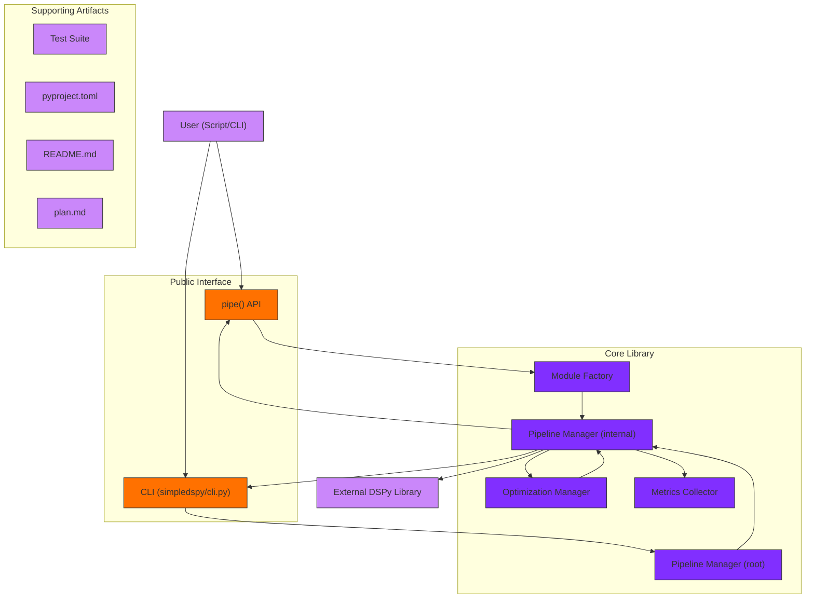

<h1 align="center">SimpleDSPy</h1>

<p align="center">
  <a href="https://pypi.org/project/simpledspy/">
    
  </a>
  <a href="https://pypi.org/project/simpledspy/">
    
  </a>
  <a href="https://opensource.org/licenses/MIT">
    
  </a>
  <a href="https://github.com/psf/black">
    
  </a>
  <a href="https://github.com/tomdoerr/simpledspy/actions/workflows/tests.yml">
    
  </a>
</p>

<p align="center">
  SimpleDSPy is a lightweight Python library that simplifies building and running DSPy pipelines with an intuitive interface.
</p>

> **Note:** This project is currently a work in progress and is not officially affiliated with or endorsed by the DSPy project. It is an independent effort to create a simplified interface for working with DSPy pipelines.

## Features

- Automatic module creation from input/output names
- Pipeline management and step tracking
- Clean, minimal API
- Built-in caching and configuration
- Type hints and documentation

## Installation

```bash
pip install simpledspy
```

## Quick Start

```python
from simpledspy import pipe

# Basic text processing
cleaned_text = pipe("Some messy   text with extra spaces")
print(cleaned_text)  # "Some messy text with extra spaces"

# Multiple inputs/outputs
name, age = pipe("John Doe, 30 years old")
print(name)  # "John Doe"
print(age)   # 30

# Custom descriptions
full_name = pipe(
    "John", "Doe", 
    description="Combine first and last names"
)
print(full_name)  # "John Doe"
```

## How It Works

The `pipe` function automatically:
1. Detects input variable names
2. Creates appropriate DSPy modules
3. Tracks pipeline steps
4. Returns processed outputs

## Architecture (credit: gitdiagram)


## Contributing

Contributions are welcome! Please open an issue or pull request on GitHub.

## License

MIT License

