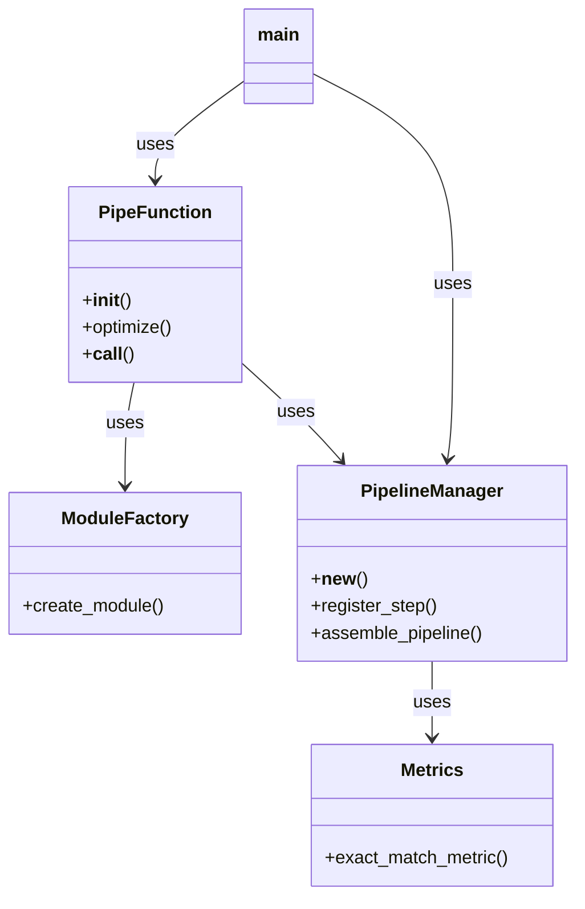

# DSPy Pipeline Code Overview

## Class Schemas

### ModuleFactory
```python
class ModuleFactory:
    def create_module(inputs: List[str], outputs: List[str], description: str = "") -> dspy.Module
```

### PipeFunction
```python
class PipeFunction:
    def __init__()
    def optimize(optimized_pipeline: Any)
    def __call__(*args, outputs: List[str] = None, modules: List[Any] = None) -> Tuple[Any, ...]
```

### PipelineManager
```python
class PipelineManager:
    def __new__() -> PipelineManager
    def register_step(inputs: List[str], outputs: List[str], module: Any)
    def assemble_pipeline() -> dspy.Module
```

### Metrics
```python
def exact_match_metric(gold: List[Any], pred: List[Any], trace=None) -> float
```

## Class Relationships



## Key Features

### Pipeline Execution
- Immediate execution of modules
- Optimized pipeline execution
- Input/output validation
- Error handling

### Module Management
- Dynamic module creation
- Signature generation
- Input/output field configuration
- Module chaining

### Optimization
- Pipeline caching
- Metric collection
- Optimization strategies
- Pipeline assembly

## Example Usage

```python
# Create pipeline
inputs = ["text", "cv"]
outputs = ["name", "degree_bool", "age"]
modules = [
    module_factory.create_module(inputs, ["name"]),
    module_factory.create_module(inputs, ["degree_bool"]), 
    module_factory.create_module(inputs, ["age"])
]

# Run pipeline
results = pipe(application_mail_text, application_cv, 
              outputs=outputs, modules=modules)

# Optimize pipeline
optimizer = MIPROv2(metric=exact_match_metric)
optimized_pipeline = optimizer.compile(
    pipeline_manager.assemble_pipeline(),
    trainset=training_data
)
```

## File Structure

```
dspy_pipeline/
├── main.py            # Main entry point
├── module_factory.py  # Module creation
├── pipe_function.py   # Pipeline execution
├── pipeline_manager.py # Pipeline management
├── metrics.py         # Evaluation metrics
├── README.md          # Documentation
└── plan.md            # Project overview
```
