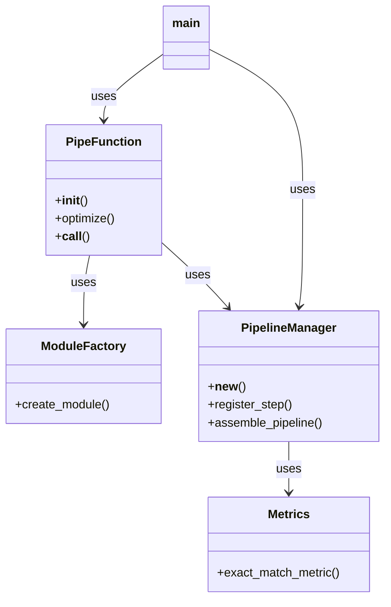

# DSPy Pipeline Code Overview

## Class Schemas

### ModuleFactory
```python
class ModuleFactory:
    def create_module(inputs: List[str], outputs: List[str], description: str = "") -> dspy.Module
```

### PipeFunction
```python
class PipeFunction:
    def __init__()
    def optimize(optimized_pipeline: Any)
    def __call__(*args, outputs: List[str] = None, modules: List[Any] = None) -> Tuple[Any, ...]
```

### PipelineManager
```python
class PipelineManager:
    def __new__() -> PipelineManager
    def register_step(inputs: List[str], outputs: List[str], module: Any)
    def assemble_pipeline() -> dspy.Module
```

### Metrics
```python
def exact_match_metric(gold: List[Any], pred: List[Any], trace=None) -> float
```

## Class Relationships



